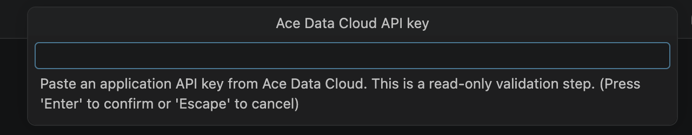
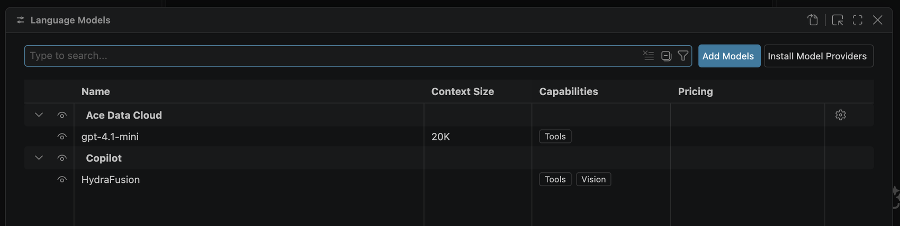
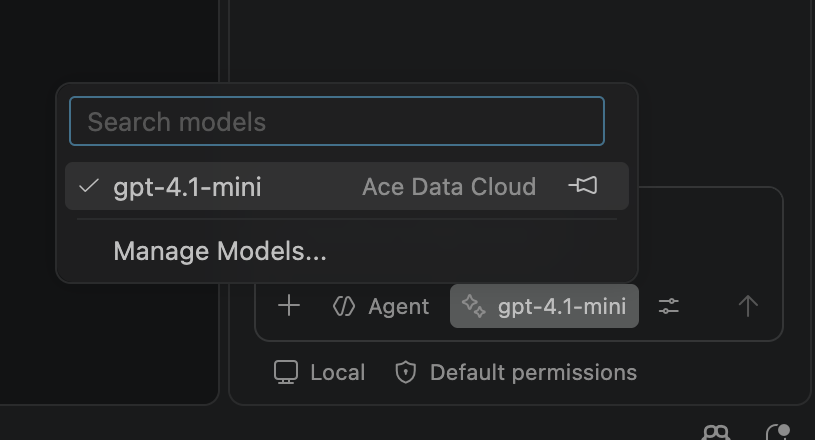
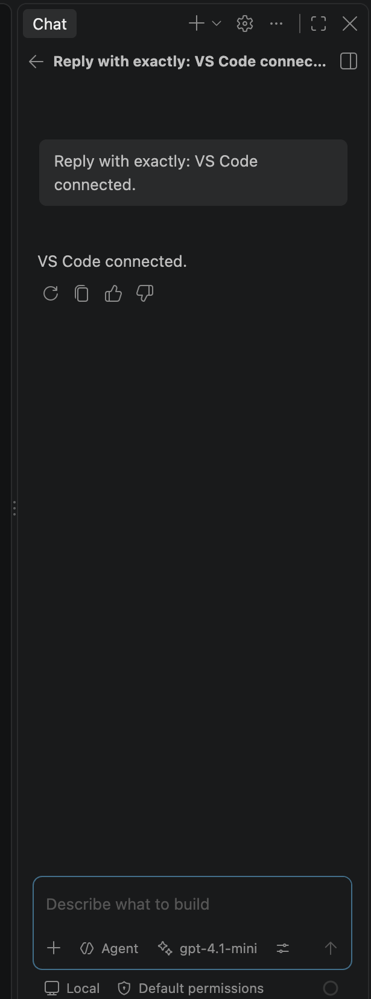

# Ace Data Cloud Chat Models for VS Code

Add an Ace Data Cloud model to the **Chat model picker** in VS Code. This guide starts with a new API key and ends with one real reply. The extension requires VS Code 1.138 or newer. Screenshots show a real English VS Code 1.141 session; the key field is empty.

[简体中文教程](README.zh-CN.md) · [Models and current pricing](https://platform.acedata.cloud/models) · [Source](https://github.com/AceDataCloud/VSCodeModelProvider)

## 1. Install and check access

Open [Ace Data Cloud Chat Models in VS Code Marketplace](https://marketplace.visualstudio.com/items?itemName=acedatacloud.chat-models), confirm the publisher is **acedatacloud**, and choose **Install**. Open VS Code's **Chat** view. If your workspace is in Restricted Mode, trust it before selecting a model.

Copilot Business and Enterprise administrators can disable Bring Your Own Language Model Key. If **Ace Data Cloud** is absent from **Manage Models** after installation, check that policy with your administrator. Chat with BYOK models does not require a Copilot plan; some editor features, such as semantic search and inline suggestions, have separate requirements.

## 2. Get an Ace Data Cloud application API key

1. Sign in to [Applications](https://platform.acedata.cloud/console/applications).
2. Open **General application** and use its API key, or choose **Manage Keys → Create** for a separate VS Code key. Check **OpenAI chat** access, current model pricing, and your balance first.
3. If you restrict **Allowed APIs**, allow the model-list and chat-completions APIs used by this extension: `GET /v1/models` and `POST /v1/chat/completions`. Copy the token string without `Bearer ` or quotes.


A platform management token is different from an application API key. Never paste an API key into Chat, a prompt file, or workspace settings.

## 3. Save the key in VS Code

Open the Command Palette and run **Ace Data Cloud: Manage Chat Models → Set or replace API key**. Paste the application key. The extension checks the model list without generating paid output and saves the key in VS Code SecretStorage.



If `gpt-4.1-mini` is available to the key, it is added automatically with conservative input and output limits. Otherwise, use **Ace Data Cloud: Manage Chat Models → Add or update chat model**, enter an exact chat-completions model ID from the current catalog, set limits within that model's documented context window, and select only capabilities it actually supports.

## 4. Show the model in Chat

In **Chat**, open the model picker beside the input box, choose **Manage Models**, find **Ace Data Cloud**, and make `gpt-4.1-mini` visible. Then select it in the model picker. The provider name and model ID should be visible before you send a prompt.





If VS Code 1.141 asks you to sign in to GitHub despite the Ace model being selected, open **User Settings (JSON)** and set `"chat.byokUtilityModelDefault": "mainAgent"`. This routes background utility tasks to your selected Ace model and can create additional billable requests. For the separate Agents window, also enable `"chat.agentHost.byokModels.enabled": true`. An organization policy that disables BYOK still applies.

## 5. Make one small request

Paste this prompt into Chat and send it once:

```text
Reply with exactly: VS Code connected.
```

You can also copy the [no-key prompt file](examples/first-chat.prompt.md) into your workspace's `.github/prompts/` folder and run it from Chat. The prompt file contains no credentials. A reply in Chat confirms that VS Code called the selected model; check [Usage](https://platform.acedata.cloud/console/usage) for the corresponding Credits charge. Billing follows your account's current package rate and selected model price.



## 6. Try tools, then add more models

`gpt-4.1-mini` is configured for agent tool calls. To test a read-only tool flow, switch Chat to **Agent** mode, enable a workspace search tool, and ask it to summarize a file in your workspace. Review each proposed tool action before allowing it. This extension never runs tools itself; VS Code invokes approved tools and returns their results to the model.

To add another supported chat model, run **Ace Data Cloud: Manage Chat Models → Add or update chat model**. The extension checks that the exact ID exists in the live API catalog; it cannot infer whether every catalog entry supports chat or tools. Check the selected model's documented capabilities and price. Choose **Chat text only** until you have verified tool and image support for it. The token limits you enter are conservative caps for VS Code's context accounting and output requests, not a claim about the model's full context size.

For image, video, music, and search tools in Agent mode, install the separate [Ace Data Cloud MCP toolbox](https://marketplace.visualstudio.com/items?itemName=acedatacloud.mcp-toolbox). Its services and credentials are managed separately from this chat model extension.

## Troubleshooting

| Symptom | Action |
| --- | --- |
| Provider absent from Manage Models | Check VS Code 1.138+, workspace trust, extension activation, and enterprise BYOK policy. |
| HTTP 401 | Replace the application API key; remove any `Bearer ` prefix, and check expiry. |
| HTTP 403 | Check chat service access, model entitlement, Allowed APIs, and content policy. |
| Model ID unavailable | Use the exact chat-completions ID from the current catalog; image and embedding models are not chat models. |
| HTTP 429 | Wait or lower request frequency; the extension does not retry automatically. |
| Interrupted or timed-out response | Check usage and request history before sending again. A partial response can still have incurred a charge. |
| Agent cannot use tools | Confirm the model supports tool calling and the tool is enabled in Agent mode. |

The extension sends prompts, selected tool definitions/results, and your API key only to `https://api.acedata.cloud`. Keys stay in VS Code SecretStorage. **Clear saved API key** removes it from this extension. See [Privacy](PRIVACY.md) and [Support](https://github.com/AceDataCloud/VSCodeModelProvider/issues).

## Development

```bash
npm ci
npm run check
npm run package
```

The extension targets VS Code's stable API and uses `GET /v1/models` for a read-only key/model check and `POST /v1/chat/completions` for streamed Chat requests. API failures are shown without copying upstream response bodies into the editor. Automatic retries are disabled.
