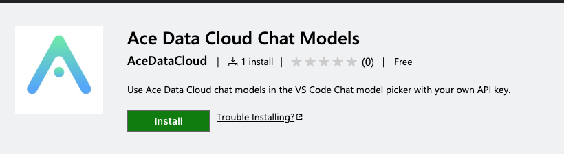

# Ace Data Cloud VS Code 聊天模型

把 Ace Data Cloud 模型加入 VS Code 的 **Chat 模型选择器**。本教程从获取 API Key 开始，到收到一次真实回复为止。扩展需要 VS Code 1.138 及以上版本。截图取自真实的英文版 VS Code 1.141 会话；Key 输入框为空。

[English guide](README.md) · [模型与实时价格](https://platform.acedata.cloud/models) · [源码](https://github.com/AceDataCloud/VSCodeModelProvider)

## 1. 安装并确认可用

打开 [VS Code Marketplace 中的 Ace Data Cloud Chat Models](https://marketplace.visualstudio.com/items?itemName=acedatacloud.chat-models)，确认发布者为 **acedatacloud**，点击 **Install**。打开 VS Code 的 **Chat**。如果工作区处于受限模式，先将其设为可信。



Copilot Business 和 Enterprise 管理员可以关闭自带模型 Key（BYOK）策略。如果安装后 **Manage Models** 里没有 **Ace Data Cloud**，请向管理员核对该策略。用 BYOK 模型聊天不需要 Copilot 订阅；语义搜索、行内建议等功能另有要求。

## 2. 获取应用 API Key

1. 登录 [Ace Data Cloud 应用管理](https://platform.acedata.cloud/console/applications)。
2. 打开 **General application**，使用现有 API Key，或选择 **Manage Keys → Create** 为 VS Code 单独创建 Key。先确认 **OpenAI chat** 服务权限、当前模型价格和余额。
3. 如果设置了 **Allowed APIs**，请允许扩展使用的模型列表和聊天接口：`GET /openai/models`、`POST /openai/chat/completions`。只复制 Token 本身，不要加 `Bearer ` 或引号。


平台管理 Token 与应用 API Key 不同。不要把 Key 写进 Chat、提示词文件或工作区设置。

## 3. 在 VS Code 保存 Key

打开命令面板，运行 **Ace Data Cloud: Manage Chat Models → Set or replace API key**，粘贴应用 Key。扩展会只读检查模型列表，不会产生付费生成，然后将 Key 保存到 VS Code SecretStorage。


若该 Key 可用 `gpt-4.1-mini`，扩展会以保守的输入、输出上限自动添加它。否则运行 **Ace Data Cloud: Manage Chat Models → Add or update chat model**，填写当前目录中的准确聊天模型 ID、该模型文档支持的 Token 上限，以及已确认支持的能力。

## 4. 在 Chat 中显示模型

在 **Chat** 输入框旁打开模型选择器，选择 **Manage Models**，找到 **Ace Data Cloud**，将 `gpt-4.1-mini` 设为可见，再从选择器中选中它。发送前确认能看到 Provider 名称和模型 ID。


如果 VS Code 1.141 已选择 Ace 模型却仍要求登录 GitHub，可打开 **User Settings (JSON)**，设置 `"chat.byokUtilityModelDefault": "mainAgent"`。这样后台辅助任务也会使用所选 Ace 模型，可能产生额外计费。若使用独立的 Agents 窗口，还需启用 `"chat.agentHost.byokModels.enabled": true`。企业禁用 BYOK 的策略仍然有效。

## 5. 发送一次最小请求

把下面的内容粘贴到 Chat，只发送一次：

```text
Reply with exactly: Marketplace extension connected.
```

也可以将[无密钥提示词文件](examples/first-chat.prompt.md)复制到工作区的 `.github/prompts/` 目录，再从 Chat 运行。收到回复说明 VS Code 调用了选中模型；到[用量页面](https://platform.acedata.cloud/console/usage)核对对应 Credits。实际费用取决于账号套餐换算率和所选模型的当前价格。


## 6. 测试工具并添加其他模型

默认的 `gpt-4.1-mini` 配置支持 Agent 工具调用。可将 Chat 切换到 **Agent** 模式，开启工作区搜索工具，让它概括工作区中的一个文件；执行前检查并批准每个工具动作。此扩展不会自行执行工具：VS Code 调用获准的工具，再把结果交给模型。

需要其他聊天模型时，运行 **Ace Data Cloud: Manage Chat Models → Add or update chat model**。扩展会检查 ID 是否存在于实时 API 目录，但目录本身不能说明每个模型都支持聊天或工具。请先核对模型能力和价格；未验证工具或图片能力时，选择 **Chat text only**。填写的 Token 值是 VS Code 上下文估算和请求输出的保守上限，并不代表该模型的完整上下文窗口。

在 Agent 模式使用图片、视频、音乐和搜索工具，请另行安装 [Ace Data Cloud MCP 合集](https://marketplace.visualstudio.com/items?itemName=acedatacloud.mcp-toolbox)。合集的服务与凭据独立管理。

## 常见问题

| 现象 | 处理方式 |
| --- | --- |
| Manage Models 中没有 Provider | 检查 VS Code 1.138+、工作区信任、扩展是否激活和企业 BYOK 策略。 |
| HTTP 401 | 更换应用 API Key，去掉 `Bearer ` 前缀，检查有效期。 |
| HTTP 403 | 检查聊天服务权限、模型准入、Allowed APIs 和内容策略。 |
| 模型 ID 不可用 | 使用当前目录中的准确聊天模型 ID；图片、Embedding 模型不能用于聊天。 |
| HTTP 429 | 等待或降低请求频率；扩展不会自动重试。 |
| 回复中断或超时 | 再发一次之前先检查用量和请求历史；部分回复也可能计费。 |
| Agent 不会用工具 | 确认模型支持工具调用，且 Agent 模式已开启相应工具。 |

扩展只向 `https://api.acedata.cloud` 发送提示词、选定的工具定义和结果以及 API Key。Key 保存在 VS Code SecretStorage 中。运行 **Clear saved API key** 可删除本扩展保存的 Key。详见 [Privacy](PRIVACY.md) 与[问题反馈](https://github.com/AceDataCloud/VSCodeModelProvider/issues)。

## 开发

```bash
npm ci
npm run check
npm run package
```

扩展使用稳定版 VS Code API，通过 `GET /openai/models` 只读核对 Key 与模型，并使用 `POST /openai/chat/completions` 进行流式请求。这两个规范路径便于准确选择权限与核对账单。报错时不把上游响应正文复制进编辑器，也不会自动重试。
